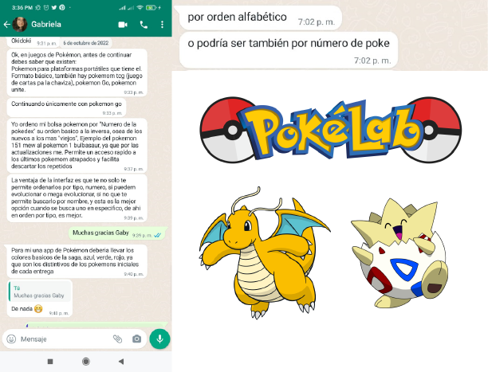
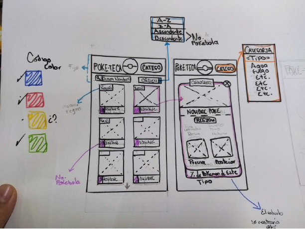
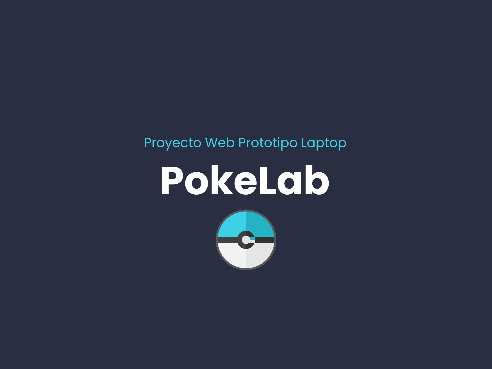
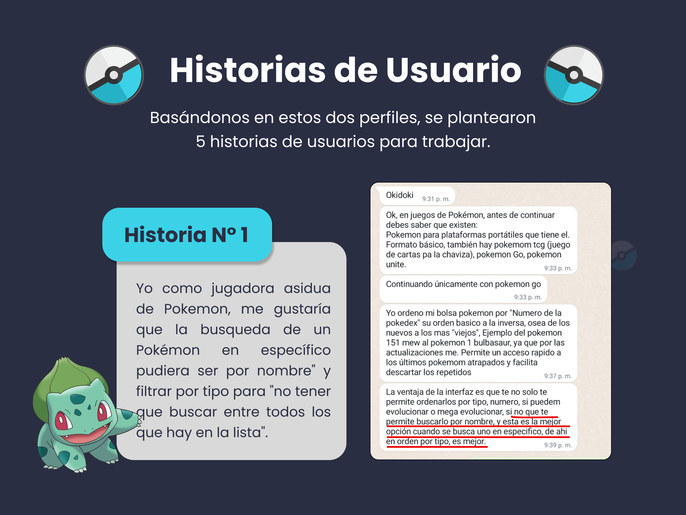
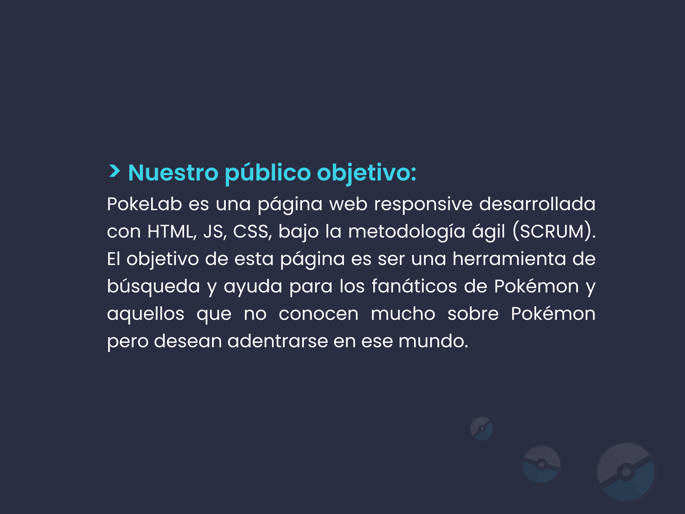
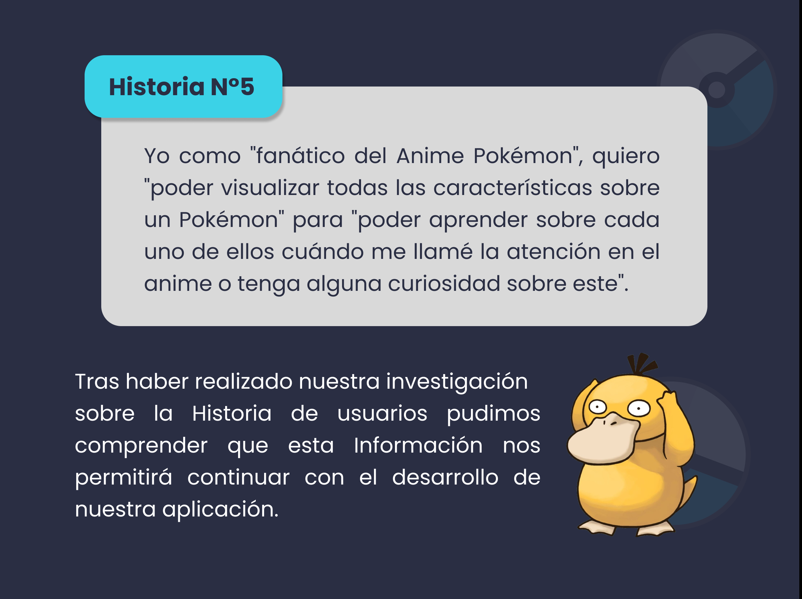
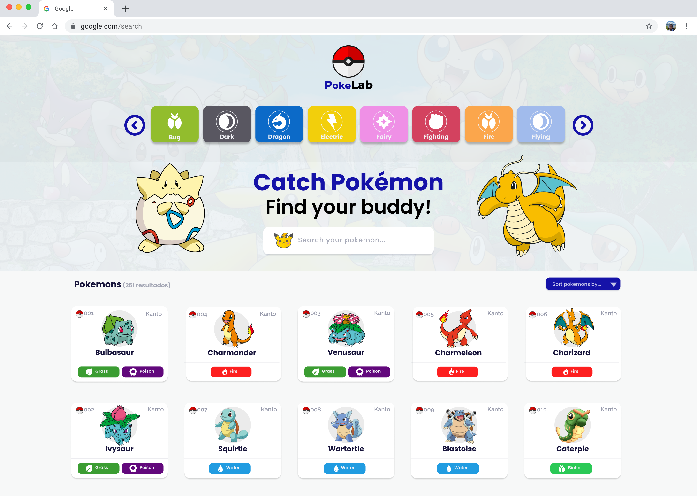
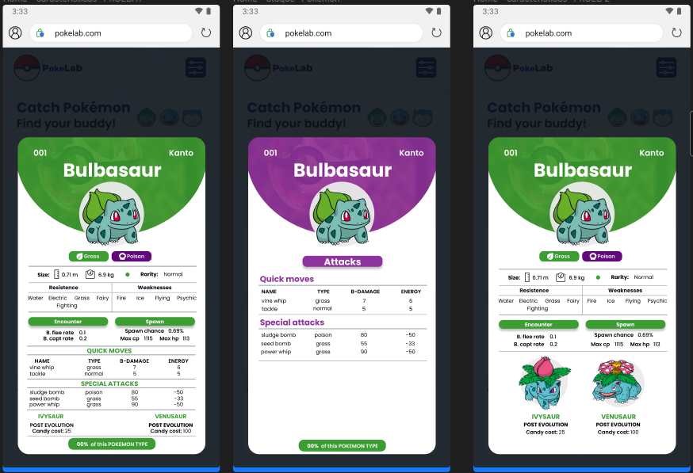
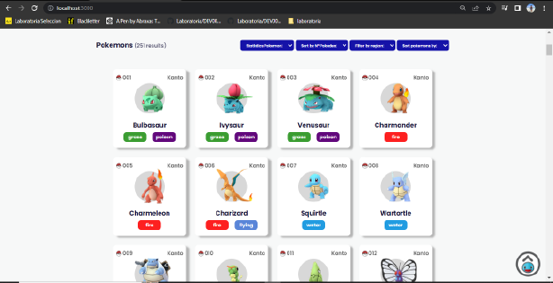

# Data Lovers

## 1. Project

In this project, **we were asked to create a web page that simulates the consumption of a REST API. The idea was to manipulate the data set to display it, filter it, sort it, etc., all with a responsive design and considering the needs of potential users**.

Our topic of choice was **Pokemon** and the first step consisted of field research to learn about the offerings of pages or applications that already exist and perform similar functions to the ones we wanted to achieve. As part of the research, small surveys were also conducted among the target audience to find out what primary needs they would consider when using the website, what they would like to see displayed, and also the design: colors, types of images or layout that remind them of Pokemon or that they would consider more eye-catching. 

## 2. Prototype

We made a hand-drawn prototype of how we would like the information to be distributed and how we considered it could be made easier to understand. 

## 3. User histories 

Next, each of our User Stories was developed (these arise from asking different users about what they would like to see on a Pokemon website and how much they know about the topic).

   
   
 

## 4. Final Prototype 

FIGMA is used for HIGH-FIDELITY prototyping.

* A non-saturated design with neutral colors was chosen.
* A color is given that distinguishes each type of Pokemon, and this color code is also planned to be used in modals and cards when specifying the Pokemon type (so they will have a faster visual reference).
* Prototyping of three different types of modals was done.

   

### Interface Objective

Here you can see the order we followed: 

* **USER STORY 2:** That the data of each Pokemon was displayed on the page showing basic information to be able to recognize them.
* **USER STORY 1:** Filtering by Pokemon type is possible, a "carousel" with the types at the top (header) was chosen instead of a dropdown menu.
* **USER STORY 1:** Each Pokemon can be searched by name, entering a character gradually filters until only the one that matches the name is displayed.
* **USER STORY 3:** Each Pokemon card can be sorted A-Z and Z-A.
* **FILTERING BY REGION:** The page can filter between the two regions included in the data: Kanto and Johto.
* **SORTING BY POKEDEX NUMBER:** The page orders the Pokemon from 1 to 250 and vice versa through a select.
* **STATISTICS BY PERCENTAGE OF POKEMON CARDS OF EACH TYPE:** The user can see the percentage of Pokemon of each type (there are 18 different types among the 250 Pokemon).

## 5. Final product design:

### ***Click on the following image to watch the video of the page's operation.***

thanks <3

### Usability testing

A final usability test was carried out with the product 90% complete to ensure that the user could manipulate it without getting lost or encountering possible failures.

## 5. Trello:

Before starting the high-fidelity prototyping, we created a task/work scheme in Trello, dividing the tasks by user stories using labels and outlining each step to be completed in order to consider them finished.

